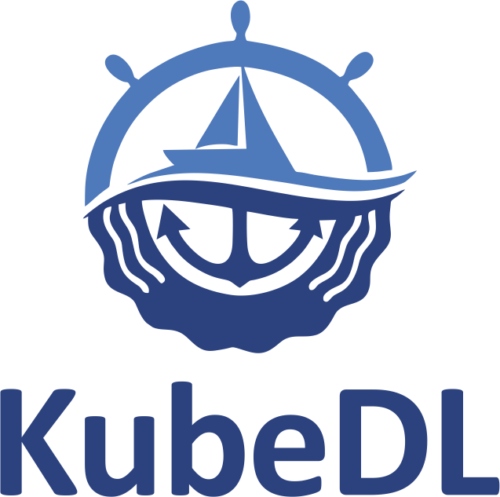

# KubeDL

<h1 align="center">
    
</h1>

KubeDL enables deep learning workloads to run on Kubernetes more easily and efficiently. 

 

  

KubeDL is a [CNCF sandbox](https://www.cncf.io/sandbox-projects/) project.

Its core functionalities include:

- Automatically tunes the best container-level configurations before an ML model is deployed as inference services. - [Morphling Github](https://github.com/alibaba/morphling)
- Model lineage and versioning to track the history of a model natively in CRD: when the model is trained using which data and which image, each version of the model, which version is running etc. 
- Enables storing and versioning a model leveraging container images. Each model version is stored as its own image and can later be served with Serving framework.  
- Support inference frameworks and training workloads (Tensorflow, Pytorch. [Mars](https://github.com/mars-project/mars) etc.)in a single unified controller.

Check the website: https://kubedl.io

 

  

## License

