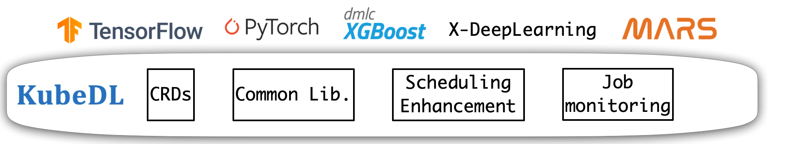
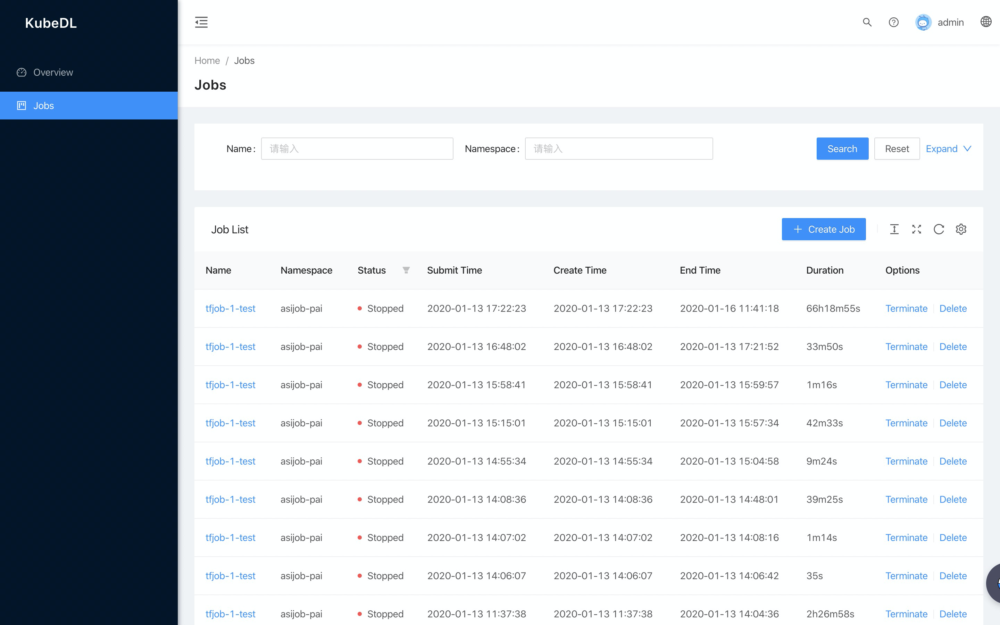

# KubeDL

[](https://www.apache.org/licenses/LICENSE-2.0.html)
[](https://travis-ci.com/alibaba/kubedl)

KubeDL is short for **Kube**rnetes-**D**eep-**L**earning. It is a unified operator that supports running
multiple types of distributed deep learning/machine learning workloads on Kubernetes.

<div align="center">
 
</div> <br/>

Currently, KubeDL supports the following types of ML/DL jobs:

- [TensorFlow](https://github.com/tensorflow/tensorflow)
- [PyTorch](https://github.com/pytorch/pytorch)
- [XGBoost](https://github.com/dmlc/xgboost)
- [XDL](https://github.com/alibaba/x-deeplearning/)

KubeDL maintains API compatibility with certain kubeflow job operators and provides additional features as below:

- Support running prevalent ML/DL workloads in a single operator.
- Support submitting a job with [artifacts synced from remote source such as github](./docs/sync_code.md ) without rebuilding the image. 
- Support advanced scheduling features such as gang scheduling with pluggable backend schedulers.
- Instrumented with unified prometheus [metrics](./docs/metrics.md)  for different types of DL jobs, such as job launch delay, current number of pending/running jobs.
- Support job metadata persistency with a pluggable storage backend such as Mysql.
- Enable specific workload type according to the installed CRDs automatically or through the startup flags explicitly.
- A modular architecture that can be easily extended for more types of DL/ML workloads with shared libraries, see [how to add a custom job workload](https://github.com/alibaba/kubedl/blob/master/docs/how-to-add-a-custom-workload.md).
- [Work-in-progress] Provide a [dashboard](#job-dashboard) for monitoring the jobs' lifecycle and stats.

## Getting started

You can deploy KubeDL using a single Helm command or just YAML files.

### Deploy KubeDL using Helm

KubeDL can be deployed with a single command leveraging the helm chart: 

```bash
helm install kubedl ./helm/kubedl 
```

You can override default values defined in `./helm/kubedl/values.yaml` with `--set` flag, for example:

```bash
helm install kubedl ./helm/kubedl --set kubedlSysNamespace=kube-system --set resources.requests.cpu=1024m --set resources.requests.memory=2Gi
```

Helm will render templates and apply them to cluster, just run the command above in root dir and be ready to go :) 


### Alternatively, deploy KubeDL using YAML File

#### Install CRDs

```bash
kubectl apply -f https://raw.githubusercontent.com/alibaba/kubedl/master/config/crd/bases/kubeflow.org_pytorchjobs.yaml
kubectl apply -f https://raw.githubusercontent.com/alibaba/kubedl/master/config/crd/bases/kubeflow.org_tfjobs.yaml
kubectl apply -f https://raw.githubusercontent.com/alibaba/kubedl/master/config/crd/bases/xdl.kubedl.io_xdljobs.yaml
kubectl apply -f https://raw.githubusercontent.com/alibaba/kubedl/master/config/crd/bases/xgboostjob.kubeflow.org_xgboostjobs.yaml
```
#### Install KubeDL operator

```bash
kubectl apply -f https://raw.githubusercontent.com/alibaba/kubedl/master/config/manager/all_in_one.yaml
```

The official KubeDL operator image is hosted under [docker hub](https://hub.docker.com/r/kubedl/kubedl).

#### Optional: Enable workload kind selectively

If you only need some of the workload types and want to disable others, you can use either one of the three options or all of them:

- Set env `WORKLOADS_ENABLE` in KubeDL container when you do deploying. The value is a list of workloads types that you want to enable. For example, `WORKLOADS_ENABLE=TFJob,PytorchJob` means only TFJob and PytorchJob workload are enabled, the others are disabled.

- Set startup arguments `--workloads` in KubeDL container args when you do deploying. The value configuration is consistent with `WORKLOADS_ENABLE` env. 

- **[DEFAULT]** Only install the CRDs you need, KubeDL will automatically enables corresponding workload controllers, you can set `--workloads auto` or `WORKLOADS_ENABLE=auto` explicitly. This is the default approach.

Check [documents](./docs/startup_flags.md) for a full list of operator startup flags.

## Run an Example Job 

This example demonstrates how to run a simple MNist Tensorflow job with KubeDL.

#### Submit the TFJob

```bash
kubectl apply -f https://raw.githubusercontent.com/alibaba/kubedl/master/example/tf/tf_job_mnist.yaml
```

#### Monitor the status of the Tensorflow job

```bash
kubectl get tfjobs -n kubedl
kubectl describe tfjob mnist -n kubedl
```

#### Delete the job

```bash
kubectl delete tfjob mnist -n kubedl
```
#### Workload types
Supported workload types are `tfjob`, `xgboostjob`, `pytorchjob`, `xdljob`, e.g.
```bash 
kubectl get xgboostjob 
```

## Tutorial
[How to run a XDL Job](docs/tutorial/xdljob.md)

## KubeDL Metrics
Check the [documents](docs/metrics.md) for the prometheus metrics supported for KubeDL operator.

## Sync Artifacts from Remote Repository
KubeDL supports submitting jobs with artifacts synced from remote source dynamically without rebuilding the image.
Currently github is supported. A plugable interface is supported for other sources such as hdfs. Check the [documents](docs/sync_code.md) for details.

## Job Dashboard
A dashboard for monitoring the jobs' lifecycle and stats is currently in progress. The dashboard also provides convenient job operation options including job creation、termination, and deletion. See the demo below.

<div align="center">
  
</div>


## Developer Guide

#### Build the controller manager binary

```bash
make manager
```
#### Run the tests

```bash
make test
```
#### Generate manifests e.g. CRD, RBAC YAML files etc

```bash
make manifests
```
#### Build the docker image

```bash
export IMG=<your_image_name> && make docker-build
```

#### Push the image

```bash
docker push <your_image_name>
```

To develop/debug KubeDL controller manager locally, please check the [debug guide](https://github.com/alibaba/kubedl/blob/master/docs/debug_guide.md).


## Community

If you have any questions or want to contribute, GitHub issues or pull requests are warmly welcome.
You can also contact us via the following channels:

- Dingtalk Group(钉钉讨论群)

<div align="center">
  
</div>

## Copyright

Certain implementations rely on existing code from the Kubeflow community and the credit goes to original Kubeflow authors.
