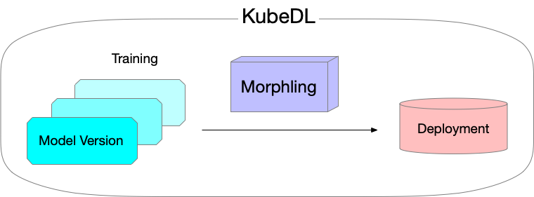

 

  

KubeDL enables deep learning workloads to run on Kubernetes more easily and efficiently. 

KubeDL is a [CNCF sandbox](https://www.cncf.io/sandbox-projects/) project. 

    

  

## Features

- Support training and inferences workloads (Tensorflow, Pytorch. [Mars](https://github.com/mars-project/mars) etc.)in a single unified controller.  Features include advanced scheduling, acceleration using cache, metadata persistentcy, file sync, enable service discovery for training in host network  etc.
- Automatically tunes the best configurations for ML model deployment. - [Morphling Github](https://github.com/alibaba/morphling)
- Package and deploy ML Model in container and track the model lineage natively with Kubernentes CRD.

Check the website: https://kubedl.io

 

  

## Getting Involved

| Platform                                                                                  | Purpose                                                                             | Estimated Response Time |
|-------------------------------------------------------------------------------------------|-------------------------------------------------------------------------------------|-------------------------|
| [DingTalk](https://github.com/kubedl-io/kubedl/blob/master/docs/img/kubedl-dingtalk.png ) | For discussions about development and questions about usage.	                       | < 1 day                 |
| [Github Issues](https://github.com/kubedl-io/kubedl/issues)                               | For reporting bugs and filing feature requests.                                     | < 2 days                |
| E-Mail(cncf-kubedl-maintainers@lists.cncf.io)                                             | For discussing specific topics or ask for help from community members/maintainers.  | < 3 days                |

## Publications

Morphling: Fast, Near-Optimal Auto-Configuration for Cloud-Native Model Serving. ACM Socc 2021[link](https://dl.acm.org/doi/10.1145/3472883.3486987)

## License

