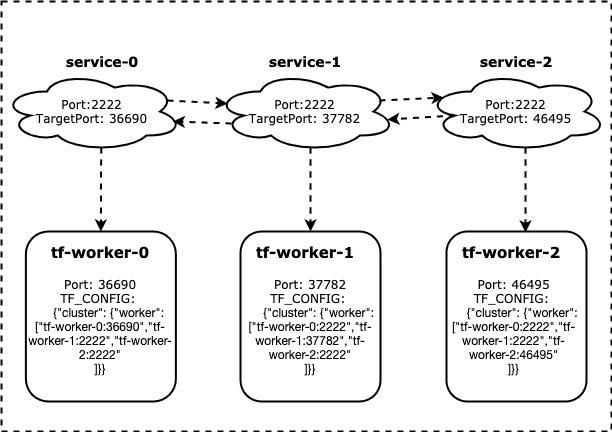

# HostNetwork Mode 

## Background

Network bandwidth is a bottleneck resource for communication-intensive jobs. However, native container
network model causes a loss to network performance, `hostnetwork` is an available solution to address this.
In addition, other scenarios (e.g: nvlink communications between containerized gpu processes) may depend on
host-network as well. 

## How To Use

KubeDL provide a feature-gate to enable `hostnetwork` mode for jobs, users only need to add an annotation
`kubedl.io/network-mode: host` to job specifications, for example:

```yaml
    apiVersion: "training.kubedl.io/v1alpha1"
    kind: "TFJob"
    metadata:
      name: "mnist"
      namespace: kubedl 
      annotations:
        kubedl.io/network-mode: 'host'
    spec:
      cleanPodPolicy: None 
      tfReplicaSpecs:
        Worker:
          replicas: 3
          ...
```

## Design

The critical path of implementing `hostnetwork-mode` is to randomize container ports replicas and make replicas accessible
 to each other. KubeDL achieves by following steps:

1. enable `hostnetwork` in `Pod` spec and set DNS policy as `ClusterFirstWithHostNet`;
2. choose a random port as container port.
3. amend target port of corresponding `Service`, and set `CluterIP` as empty string(instead of `None`), so that kube-proxy will be able to forward traffic from `Port` to `TargetPort`.
4. amend environments in job cluster spec. 
5. handling replica fail-over and patch latest available port to keep connection alive.

here is a `TFJob` example:

<div align="center">
 
</div> <br/>
