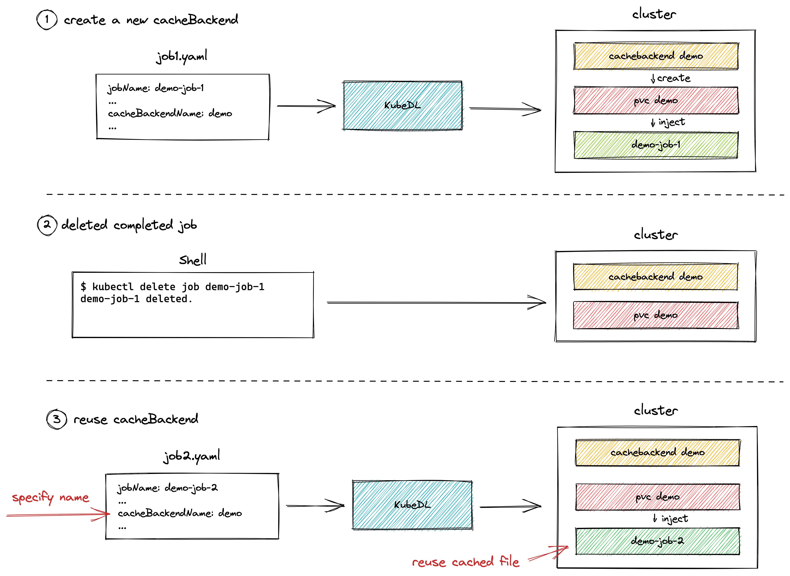
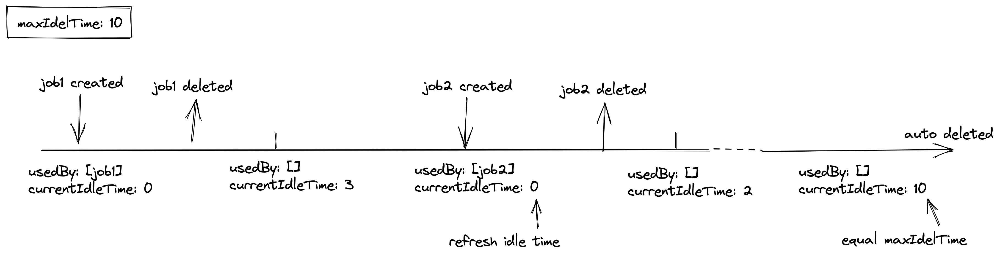

# Design for CacheBackend reuse

- [Motivations](#motivations)
- [Use Case](#use-case)
- [Proposal](#proposal)
- [Implementation](#implementation)

## Motivations

Fluid-based CacheBackend was implemented in the last PR, which provides KubeDL with the basic ability to cache datasets. However, in previous implementation, CacheBackend was bound to the DL job that created it, which meant that if the job was deleted after completed, the CacheBackend attached to the job was also deleted.

To enable the CacheBackend created by the previous Job can be reused by the next Job, we want to keep the CacheBackend even if the job that created it is deleted. In this way, user can avoid creating CacheBackend repeatedly and skip the step of caching remote files, thus improving the efficiency of CacheBackend. 

Here's a simple illustration:



In addition, to release CacheBackend that has not been used for a long time, I think we can also add an option to CacheBackend, maxIdleTime, to set the maximum amount of time CacheBackend can be idle. KubeDL automatically deletes the unused CacheBackend to ensure that cache files do not consume too many space in the cluster.

### Goals

- CacheBackend in KubeDL can be retained after a job ends and can be reused by specifying the name of CacheBackend to improve utilization efficiency.
- Add maxIdleTime options for CacheBackend to configure when CacheBackend can be deleted.

## Use case

Added use cases for cache reuse:

1. The user wants to simply create a one-off CacheBackend that will be deleted after the job completes.
2. The user creates a new CacheBackend and expects it to be retained after this job completes so that the cached dataset files can be reused in the next job.
3. The user wants to specify the name of CacheBackend when creating a job to use the CacheBackend retained in a previous job
4. When creating CacheBackend, the user can specify maxIdleTime. If a CacheBackend is idle for more than maxIdleTime, the CacheBackend is automatically deleted to save space.

### Demo 

CacheBackend needs to be created for the first time use.
```yaml
apiVersion: "training.kubedl.io/v1alpha1"
kind: "TFJob"
metadata:
  name: "mnist1"
  namespace: kubedl
spec:
  cleanPodPolicy: None
  CacheBackend:
    metadata:
      name: "DemoCacheBackend"
    spec:
      mountPath: "/data"   
      dataset:
        dataSources:
          - location: local:///dataset/mnist
            subDirName: mnist
      options:
        maxIdleTime: "10h"
      cacheEngine:
        fluid:
          alluxioRuntime:
            replicas: 1
            tieredStorage:
              - cachePath: /dev/shm
                quota: "1Gi"
                mediumType: MEM
  tfReplicaSpecs:
    ...
    No additional dataset volumes need to be configured. 
    The cache controller will automatically inject the pvc created by fluid into the container
```

Next time only need to specify the name of CacheBackend and the mount path in containers can enable cache.
```yaml
apiVersion: "training.kubedl.io/v1alpha1"
kind: "TFJob"
metadata:
  name: "mnist2"
  namespace: kubedl
spec:
  cleanPodPolicy: None
  CacheBackend:
    metadata:
      name: "DemoCacheBackend"
    spec:
      mountPath: "/data"   
  tfReplicaSpecs:
    ...
```

## Proposal

For CacheBackend in KubeDL to have the ability to be reused by multiple jobs, we may need to add the following fields to existing CacheBackend:

1. `metadata.name`：A user specifies which CacheBackend to use by giving a CacheBackend's  `name`
2. `status.usedBy`：A list of  jobs that use the CacheBackend. When the length of usedBy list is 0, CacheBackend enters idle time.
3. `spec.options.maxIdleTime`：Used to configure the maximum idle time (the duration for which `status.usedBy` is null) for a CacheBackend. If maxIdelTime is not configured, we can always keep this CacheBackend.
5. `status.currentIdleTime`：Current idle time of the  CacheBackend. When the value of `status.currentIdleTime` equals maxIdleTime, CacheBackend and the resources it occupies are released

A CacheBackend lifetime is given below to illustrate the meaning of these fields



The above fields mean that currently CacheBackend configuration can only be modified dynamically if len(usedBy) is 0 or 1, because a CacheBackend instance can be used by multiple jobs.

## Implementation

According to the above description, the major changes are in these:

1. When creating a Job, the Job Controller checks whether the specified CacheBackend already exists

   - If yes, check the CacheBackend parameter specified in the Job
     - No parameter is configured, then the state of CacheBackend is updated and the created pvc is injected into the pods of the job
     - CacheBackend specifies parameters. Check whether it can update existing CacheBackend. If it can be merged, update the configuration. If not, report conflict and requests user to resubmit the job.

   - If CacheBackend does not exist, create it with the CacheBackend's name specified by the Job

2. The CacheBackend Controller checks whether usedBy list is null before reconciling

   - If usedBy list is null, update currentIdleTime to CacheBackend and check whether equals maxIdelTime. If CacheBackend has not been used for a long time, delete it.
   - If it is not null, the subsequent reconcile procedure is performed
