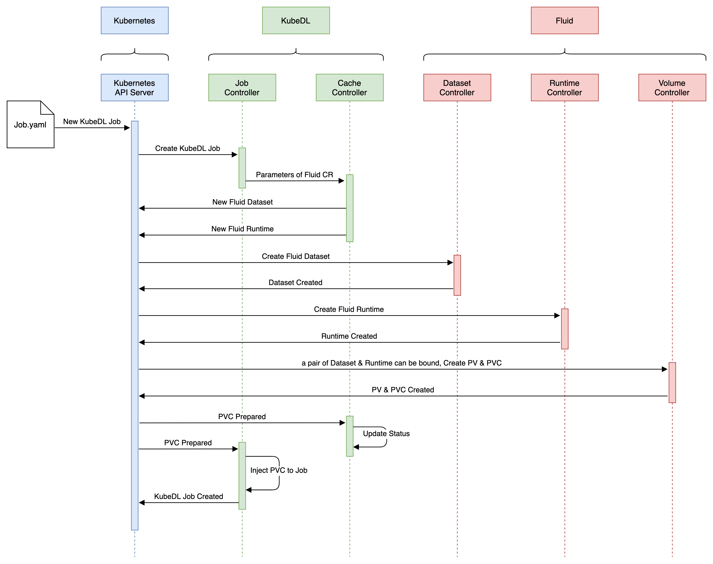

# Implementation design for data cache

- [Motivations](#motivations)
- [Use Case](#use-case)
- [Proposal](#proposal)
- [Implementation](#implementation)
- [Alternatives Considered](#alternatives-considered)

## Motivations

A deep learning job usually consists of data preprocessing, data loading to GPU memory, and model training. In these processes, I/O of datasets is one of the bottlenecks affecting the training time of deep learning jobs. Improving the access speed of datasets can reduce the time spent in training, improve the utilization rate of GPU and the efficiency of model training.

Existing deep learning or other data-intensive applications based on Kubernetes mostly take advantage of the volume feature provided by Kubernetes, and provide data for jobs by mounting file systems. Although this method is flexible, it does not make good use of data locality to reduce the overhead on data reading.

[Fluid](https://github.com/fluid-cloudnative/fluid) is an open source Kubernetes-Native distributed dataset coordinator and accelerator for data-intensive applications. Fluid uses dataset abstraction and cache engine as the basic unit for scheduling and management, allowing applications running on Kubernetes to have the capability of distributed data caching. Compared with the original solution, the data I/O time after using Fluid caching will be greatly reduced.

Therefore, using Fluid to provide data cache acceleration for the dataset in the KubeDL job is an effective and feasible solution.

### Goals

- Enable KudeDL to transparently create dataset and cache runtime through Fluid (deployed in the same cluster) interface, and provide the generated pvc to the job to complete the cache acceleration of the dataset required by the training job.
- Provides users with an easy-to-use API and allows them to implement basic parameter configuration as required.

## Use case

User submit deep learning jobs in a Kubernetes cluster with Fluid and KubeDL deployed, and :

1. User wants to specify that the dataset under a certain file path can be cached, so that the time spent on data I/O can be reduced, and the user does not need to know how the dataset is cached.

2. User hopes to be able to specify parameters such as the cache path and the medium used by the Fluid, so that the use of storage resources can be more flexibly allocated according to the needs of users.

3. User hopes to simplify the usage as much as possible, and it is better not to create yaml files other than job.yaml file, so as to reduce the mental burden of users.

## Proposal

Add a new feature, data cache, which will:
1. Add an data cache field to the job manifest of KubeDL, which will be provided to the user to specify the parameters for the data cache that they will use to flexibly configure how their data will be cached. The parameters will be discussed below.
2. Add a Controller which primary purpose is to parse parameters about the data cache in user-submitted jobs and provide default values for some optional fields.
3. Add a checker that checks to see if available fluids are deployed within the cluster and, if not, prompts the user that data cache is not available.
4. Add a client that interacts with the api server. After the parameters related to the data cache are resolved, the parameters are submitted to the fluid in the cluster through the api server and the dataset and create the dataset and cache runtime (usually alluxio runtime), which are apis provided by the fluid.
5. Add a watch feature that will use client to monitor if a new pv&pvc pair are created in the cluster (if dataset and runtime are successfully created, fluid will bind them and create a pair of pv and pvc).
6. Add a Injector which injects the pvc created by fluid into the container. This allows jobs to access files in the cached path and enjoy data acceleration.

## Implementation

### Sequence Diagram

FYR. The final implementation may be slightly different from this diagram.


The general process is as follows:

1. The user submits a yaml file describing the job whose field contains the parameters of the data cache, which means that the job will use the feature of the data cache.
2. KubeDL's Job Controller detects that a job with data cache parameters has been created, and it passes the parameters to the controller responsible for enable data cache.
3. After verifying that the parameters are correct, the cache controller adds defaults to the missing parameters and creates a client. The client checks to see if Fluid has been deployed in the Kubernetes cluster, and if so, it will create the dataset and cache runtime by the api server.
4. The volume controller from Fluid detects that there is a pair of dataset and runtime in the cluster that can be bound, and it will automatically create pv and assign pvc to it. Users can enjoy data cache by mounting this pvc.
5. When the listener in KubeDL detects that pvc is created, it will notify the cache controller and pass relevant information about pvc to the controller.
6. Controller receives the parameters of the pvc and injects the pvc into the container of the KubeDL job.

With the above process, the dataset in the specified file system can be cached, which means that the time for the KubeDL job to access the dataset will be greatly reduced.

### Cache Configuration

Reference to the configuration of `modelVersion` in `example/tf/tf_job_mnist_modelversion.yaml`

```yaml
apiVersion: "training.kubedl.io/v1alpha1"
kind: "TFJob"
metadata:
  name: "mnist"
  namespace: kubedl
spec:
  cleanPodPolicy: None
  cacheBackend:
    mountPath: "/data"   
    dataset:
      dataSources:
        - location: local:///dataset/mnist
          subDirName: mnist
    cacheEngine:
      fluid:
        alluxioRuntime:
          replicas: 1
          tieredStorage:
            - cachePath: /dev/shm
              quota: "1Gi"
              mediumType: MEM
  tfReplicaSpecs:
    ...
    No additional volumes need to be configured. 
    The cache controller will automatically inject the pvc created by fluid into the container
```

Compared with the first configuration method mentioned in **Alternatives Considered**, the advantage of this configuration data cache is that:
1. The structure of the above method is clearer and easier to parse or use than using plain strings to configure parameters
2. This method is more conducive to supporting the hierarchical storage configuration provided by Fluid, while it is difficult to describe the multilayer and multidirectory configurations using plain strings

A partial list of supported options, full list TBD

```yaml
mountPath: "/path/in/container"				 # Path to mount into container(required)

# Required parameters for dataset
path: "/file/system/dataset/path"   # Directory of the dataset to be mounted(required)
subdirName: "mnist"

# Required parameters for Runtime
quota: "4Gi"                                             # Maximum cache capacity allowed for this level of storage(required)
mediumtype: "MEM"                                        # The default is MEM, and SSD and HDD are optional(optional)
cachePath: "/dev/shm"                                    # The data is cached at the node where the alluxio worker is located(optional)
ParametersToBeAdd...
```

## Alternatives Considered

- Other optional configuration methods:

  Referring to the configuration methods of other kubedl features (such as code synchronization), the configuration list in plain string form is adopted. This method has been compared above. Personally, I think the configuration method mentioned in implementation is slightly better than the following.

  ```yaml
      apiVersion: "training.kubedl.io/v1alpha1"
      kind: "TFJob"
      metadata:
        name: "mnist"
        namespace: kubedl
        annotations:
   +      kubedl.io/fluid-config: '{"dataSource":"/file/system/dataset/path","mountPath":/path/in/containe","quota":"4Gi"}'
      spec:
        cleanPodPolicy: None
        tfReplicaSpecs:
          ...
  ```

  Of course, another direct idea is to directly parse the parameters in volumes and automatically create a dataset for the hostpath or NFS file path. Although this method is relatively easier to be used by users, it is not flexible enough, because once the number of mounted volumes increases, it will be difficult to describe the mapping relationship between parameters and volumes.

   ```yaml
        apiVersion: "training.kubedl.io/v1alpha1"
        kind: "TFJob"
        metadata:
          name: "mnist"
          namespace: kubedl
          annotations:
     +      kubedl.io/fluid-config: '{"isEnable": "True","quota": "4Gi"}'
        spec:
          cleanPodPolicy: None
          tfReplicaSpecs:
            ...
            volumes:
              - name: "XXX"
                hostPath:
                  path: "/file/system/dataset/path"
                  type: DirectoryOrCreate
   ```

- How to handle the Fluid generated dataset and Runtime after the job is completed?

  Unused for a certain period of time can be automatically removed, which means that a monitor needs to be added to monitor the status of the created dataset and runtime.

- How to describe the multi levels storage cache provided by fluid?

  It is easy to describe fluid's multi levels storage configuration using the configuration described in implementation.

- Is it necessary to maintain the available status of fluid in kubedl?

  No, the key is that if the user uses the cached feature but does not deploy the fluid in the kubernetes cluster, the kubedl job should create a failure and tell the user the reason for the failure. If fluid is deployed, there is no problem.

