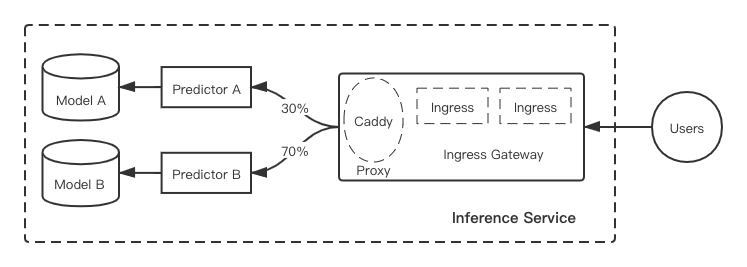

# light-weighted traffic control for inference

### Motivations

In the AI inference scenarios, it usually involves multi-model services (loading different versions of AI models and providing inference services to users). For scenarios where multiple models coexist, it is usually necessary to do some refined routing for user inference requests. 

Currently, some open source solutions such like kfserving usually rely on the heavier istio to do traffic forwarding，similar as the current implementation of kubedl.

But in fact istio is a very heavy dependency, what we actually need in  inference scenario is only part of its gateway function，And if we want to do some customized serving-specific optimizations，the cost of customed maintenance for these external projects is high.

So we plan to build a lightweight service-level traffic management for kubedl, not only for just simplifying the reliance of traffic management, but also for better optimize scenarios such as future model canary release , multi-stage inferencing, and batching in the future.

### User case

1. User deploys an inference service with model A initially, and after a new model B is developed, he wants to release it in canary.
2. User deploys an inference service with multiple models coexist, he wants to split the traffic based on user client requests(e.g: request header/cookie)

### Proposal

current kubedl inferencing service core workflow:
* When an inference crd created, we first sync entrypoint service to access inference service for users.
* Sync each predictor to deploy containers mounted with specific model and also create a svc for each predictor.
* If inference serves multiple model version simultaneously and canary policy has been set, we create virtualservice(crd in istio) regulation forwarding to different predictor svc.

In the above workflow, the main point we can optimize is the dependence on virtualservice (istio). In order to reduce the external dependency and complexity, we plan to launch a customized ingress controller as a service-level gateway for each inference service.

The envisaged workflow is roughly as follows:
* When an inference crd created, We will create this inference ingress gateway as a sidecar and create a svc for this ingress gateway, it serves as the entrance of the entire inference service.
* Sync each predictor to deploy containers mounted with specific model and also create a svc for each predictor.
* According to the configuration of predictor，we will generate corresponding ingress configurations.

### Implementation

As described above, the main job is to customize the service ingress gateway. I plan to build this customed ingress gateway with Caddy.

Caddy is a reverse proxy written in Golang and even has no runtime dependencies. More importantly, it is simple and extensible. i will use Caddy to do real forwarding in ingress gateway.

Therefore, the implementation of this ingress gateway is:
* use informer to listen to the kube apiserver, define some event handlers when ingress events reach,  the core is to establish a certain mapping relationship, such as predictor name and the corresponding svc address.
* Use Caddy to forward to the real traffic.

The flow chart is as follows:

ref:
* https://github.com/kubeflow/kfserving/
* https://caddyserver.com/
* https://dgraph.io/blog/post/building-a-kubernetes-ingress-controller-with-caddy/
