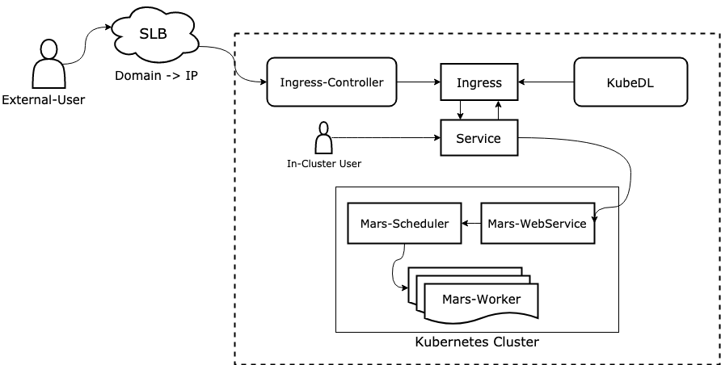

# Run Mars workloads on kubernetes

## What's Mars

`Mars` is a tensor-based unified framework for large-scale data computation which scales Numpy, Pandas and Scikit-learn, 
see [mars-repo](https://github.com/mars-project/mars) for details. As a data computation framework, `mars` is easy to 
scale out and can run across hundreds of machines simultaneously to accelerate large scale data tasks.<br>

A distributed mars job includes 3 roles to collaborate with each other：
- **WebService**: web-service accepts requests from end-users and forwards the whole tensor-graph to scheduler, it provides a dashboard for end users to track job status and submit tasks interactively.
- **Scheduler**: scheduler compiles and holds a global view of tensor-graph, it schedules 'operands' and 'chunks' to workers.
- **Worker**:  worker listen to 'operands' and 'chunks' dispatched by scheduler, executes the tasks, and reports results back to scheduler.

## Run Distributed Mars Job in Standalone Mode


In standalone mode, a distributed `Mars` job are running standalone on bare hosts without the help of other container orchestration tools.

1. run `pip install pymars[distributed]` on every node in the cluster to install dependencies needed for distributed execution.
2. start different mars role processes on each node.
    - `mars-scheduler -a <scheduler_ip> -p <scheduler_port>`
    - `mars-web -a <web_ip> -p <web_port> -s <scheduler_ip>:<scheduler_port>`
    - `mars-worker -a <worker_ip> -p <worker_port> -s <scheduler_ip>:<scheduler_port>`
3. usually there must be at least 1 web-service and 1 scheduler and a certain number of workers.
4. after all processes started, users can open the python console run snippet to create a session with web-service and submit tasks.

```python
import mars.tensor as mt
import mars.dataframe as md
from mars.session import new_session
new_session('http://<web_ip>:<web_port>').as_default()
a = mt.ones((2000, 2000), chunk_size=200)
b = mt.inner(a, a)
b.execute()  # submit tensor to cluster
df = md.DataFrame(a).sum()
df.execute()  # submit DataFrame to cluster
```
 
Running `Mars` job in standalone mode requires manual configuration effort and lack other abilities such as automatic failover of workers.

## Run Mars Job on Kubernetes with KubeDL

Run `mars` job on kubernetes natively.

#### 1. Deploy KubeDL

Follow the [installation tutorial](https://github.com/alibaba/kubedl#getting-started) in README and deploy `kubedl` operator to cluster.

#### 2. Apply Mars CRD

`Mars` CRD(CustomResourceDefinition) manifest file describes the structure of a mars job spec. Run the following to apply the CRD:

```bash
kubectl apply -f https://raw.githubusercontent.com/alibaba/kubedl/master/config/crd/bases/kubedl.io_marsjobs.yaml
``` 

#### 3. Create a Mars Job

Create a YAML spec that describes the requirements of a MarsJob such as the worker, scheduler, WebService like below

```yaml
apiVersion: training.kubedl.io/v1alpha1
kind: MarsJob
metadata:
  name: mars-test-demo
  namespace: default
spec:
  cleanPodPolicy: None
  webHost: mars.domain.com
  marsReplicaSpecs:
    Scheduler:
      replicas: 1
      restartPolicy: Never
      template:
        metadata:
          labels:
            mars/service-type: marsscheduler
        spec:
          containers:
            - command:
                - /bin/sh
                - -c
                - python -m mars.deploy.kubernetes.scheduler
              image: mars-image
              imagePullPolicy: Always
              name: mars
              resources:
                limits:
                  cpu: 2
                  memory: 2Gi
                requests:
                  cpu: 2
                  memory: 2Gi
          serviceAccountName: kubedl-sa
    WebService:
      replicas: 1
      restartPolicy: Never
      template:
        metadata:
          labels:
            mars/service-type: marswebservice
        spec:
          containers:
            - command:
                - /bin/sh
                - -c
                - python -m mars.deploy.kubernetes.web
              image: mars-image
              imagePullPolicy: Always
              name: mars
              resources:
                limits:
                  cpu: 2
                  memory: 2Gi
                requests:
                  cpu: 2
                  memory: 2Gi
          serviceAccountName: kubedl-sa
    Worker:
      replicas: 2
      restartPolicy: Never
      template:
        metadata:
          labels:
            mars/service-type: marsworker
        spec:
          containers:
            - command:
                - /bin/sh
                - -c
                - python -m mars.deploy.kubernetes.worker
              image: mars-image
              imagePullPolicy: Always
              name: mars
              resources:
                limits:
                  cpu: 2
                  memory: 2Gi
                requests:
                  cpu: 2
                  memory: 2Gi
          serviceAccountName: kubedl-sa
status: {}
```

The `spec` field describes the requirement of each replica, including `replicas`, `restartPolicy`, `template`...and
the `status` field describes the job current status. Run following command to start an example mars job:

```bash
kubectl create -f example/mars/mars-test-demo.yaml
```

Check the mars job status:

```bash
$ kubectl get marsjob
NAME             STATE     AGE   TTL-AFTER-FINISHED   MAX-LIFETIME
mars-test-demo   Running   40m
$ kubectl get pods
NAME                                            READY   STATUS             RESTARTS   AGE
mars-test-demo-scheduler-0                      1/1     Running            0          40m
mars-test-demo-webservice-0                     1/1     Running            0          40m
mars-test-demo-worker-0                         1/1     Running            0          40m
mars-test-demo-worker-1                         1/1     Running            0          40m

``` 

#### 4. Access web-service.

<div align="center">
 
</div> <br/>

Web service visualizes job status, computation process progress and provides an entry for interactive submission. 
However, web service instance was running as a pod inside a kubernetes cluster which may not be accessible by external users.
`KubeDL` provides two access modes for users in different network environment.

##### 4.1 Access web-service in-cluster.

For users in the same network environment with web service instance, they can directly access its *service* without any other additional configurations,
and the address is formatted as: `{webservice-name}.{namespace}`, it is a `A` record generated by `CoreDNS`, so you have to ensure that `CoreDNS` has been
deployed.

##### 4.2 Access web-service outside cluster.

For users in different network environment(e.g. an internet user wants to access a mars web-service running in vpc), 
users have to apply an SLB address first, so that they can ping the ip in **vpc** with a public address by SLB domain resolving, then in job spec, users just need fill the `spec.webHost` field with 
their applied SLB address, `KubeDL`will generated ingress instance with routing rules, so that external traffic can be routed to target web service and that
becomes available for outside users.

#### 5. Memory Tuning Policy

`Worker` is the role that actually performs computing tasks in `MarsJob`. 
Mars supports running jobs in different memory usage scenarios. For example, swap cold in-memory data out to spill dirs and persist in kubernetes ephemeral-storage.
`Mars` provides plentiful memory tuning options which has been integrated to `MarsJob` type definition, including :

- plasmaStore: PlasmaStore specify the socket path of plasma store that handles shared memory between all worker processes.
- lockFreeFileIO: LockFreeFileIO indicates whether spill dirs are dedicated or not.
- spillDirs: SpillDirs specify multiple directory paths, when size of in-memory objects is about to reach the limitation, mars workers will swap cold data out to spill dirs and persist in ephemeral-storage.
- workerCachePercentage: WorkerCachePercentage specify the percentage of total available memory size can be used as cache, it will be overridden by workerCacheSize if it is been set.
- workerCacheSize：WorkerCacheSize specify the exact cache quantity can be used.

users can set above options in `job.spec.memoryTuningPolicy` field: 

```yaml
apiVersion: training.kubedl.io/v1alpha1
kind: MarsJob
metadata:
  name: mars-test-demo
  namespace: default
spec:
  cleanPodPolicy: None
  memoryTuningPolicy:
    plasmaStore: string              # /etc/pstore/...
    lockFreeFileIO: bool             # false
    spillDirs: []string              # ...
    workerCachePercentage: int32     # 80, indicates 80%
    workerCacheSize: quantity        # 10Gi
  marsReplicaSpecs:
    ...
```
